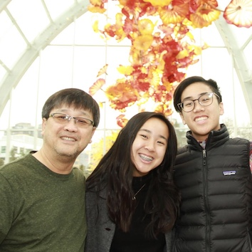

## About us

We are a team of 3: father, daughter and son.

Hung (dad) is a software engineer in Silicon Valley. Amanda and Chris are juniors in high school.

(From Hung)
This product started out just as a one week-end project for personal use.
Then I got a few emails inquiring about it. Soon it became quite clear that I need to treat this as a release product: 
it needs to be built, QA'ed, packaged and released properly. I also need to create a web site, getting the words out,
handling customer emails ... Then it dawned on me that it would be a perfect vehicle to help introducing my
daughter and son to what it likes to create a product, market it, support it and interact with paying customers. 
So I got them involved.

We strive to make you a happy customer.

* We make sure our product is well tested and works correctly the first time.
* On our web site, we clearly explain what our product does.
* If you have question or concern, we will give your email our full attention and get back to you promptly.

Thank you for your support,

Hung/Amanda/Chris

Back to [ac2ofx home page](/ac2ofx/)
